# Intro to Drupal

http://nickgrace.github.io/intro-to-drupal

---

## Hi! we're...

* Nick Grace, front end development manager at [JBS International, Inc.](http://www.jbsinternational.com) I'm [@nickgrace](https://twitter.com/nickgrace) just about everywhere.

* Gordon Ng, director of ux & web development at [JBS International, Inc.](http://www.jbsinternational.com) I'm [@pangeum](https://twitter.com/pangeum) just about everywhere.

---

## JBS International, Inc.


---

## Agenda

* History of SEO
* Rich Snippets
* Google's Knowledge Graph
* Schema.org Module
* The Future of Schemas, the DOM, and SEO

---

# History of SEO

---

## Apr 1993: Mosaic 1.0

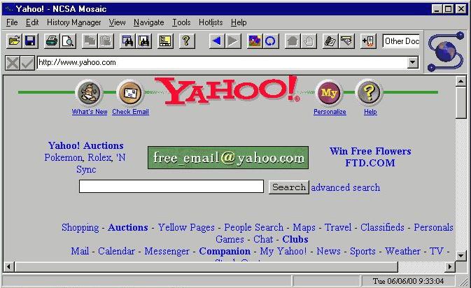

---

## Apr 1994: Yahoo & Search Engine Submission


---

## Aug 1995: Internet Explorer 1


---

## Dec 1995: Altavista & On-Page SEO

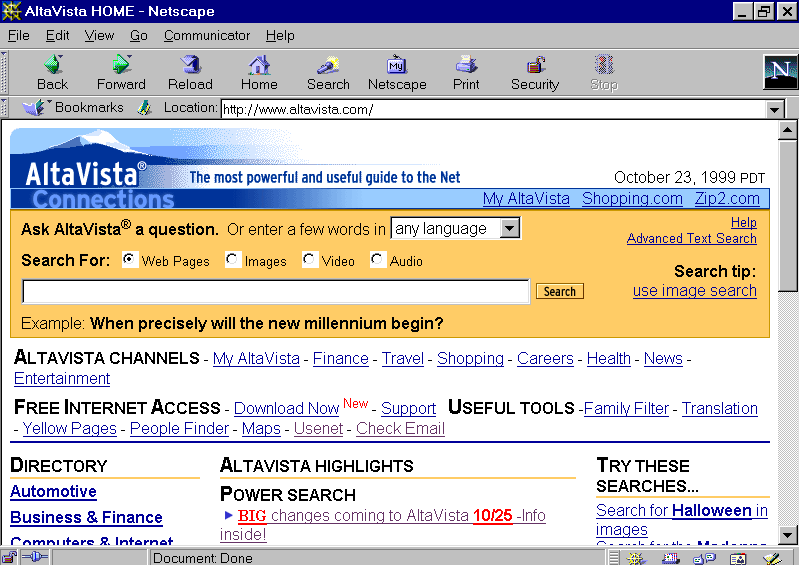

---

## Sep 1998: Google Launches

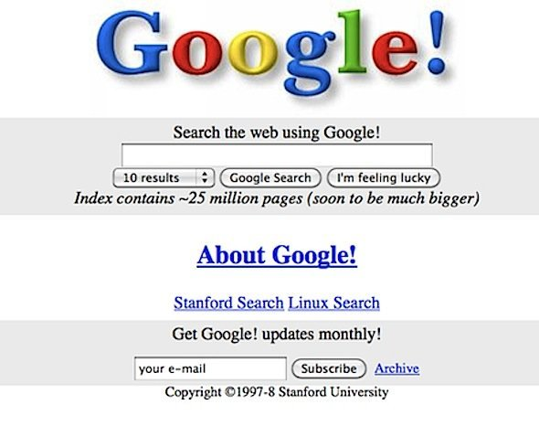

---

## Dec 2000: Google PageRank

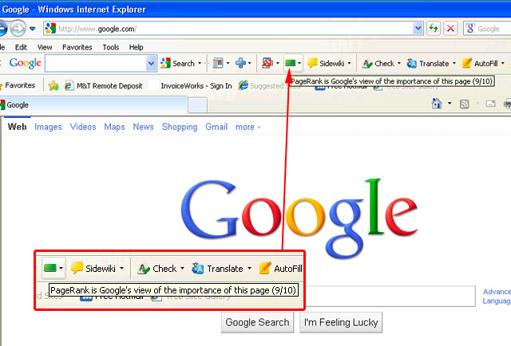

---

## Mar 2003: Google AdSense

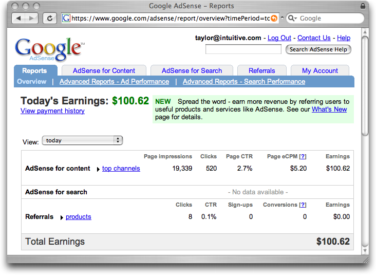

---

## Made for AdSense


---

## Made for AdSense

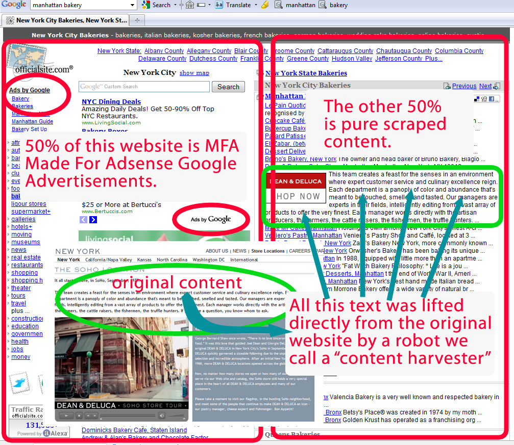

---

## Sep 2003: Florida Update & Death to Keyword Stuffing

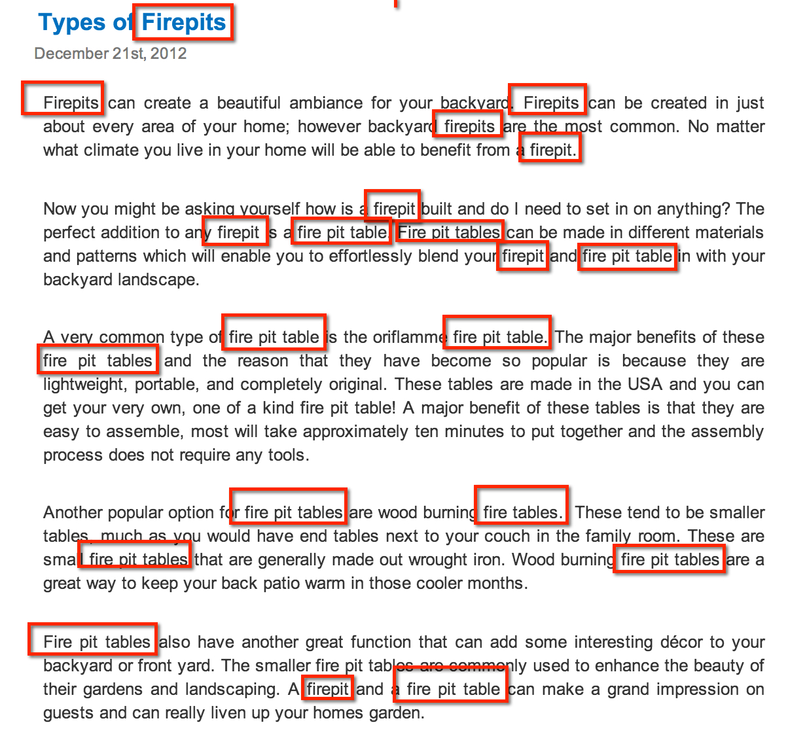

---

## Nov 2005: Jagger & Big Daddy Updates (Trustability of Links)


---

## Jul 2007: Universal Search

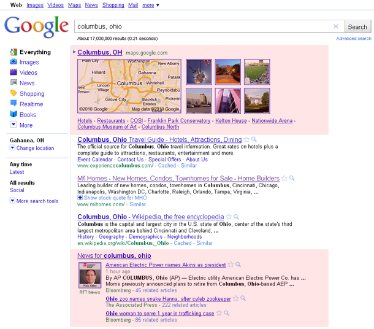

---

## Feb 2011: Panda Algorithm & Death to Content Farms

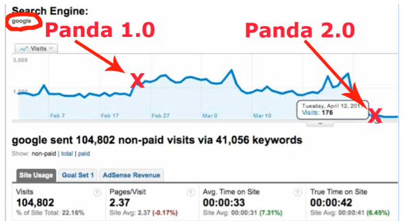

Established the power of content

---

## Content Farms


---

## May 2012: Knowledge Graph

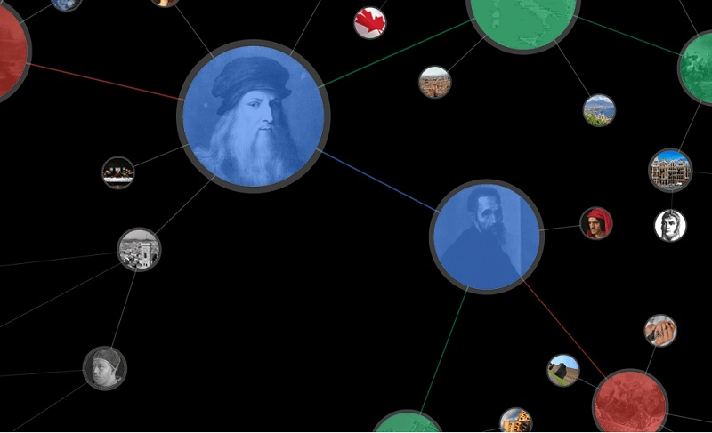

---

## Aug 2013: Hummingbird Algorithm

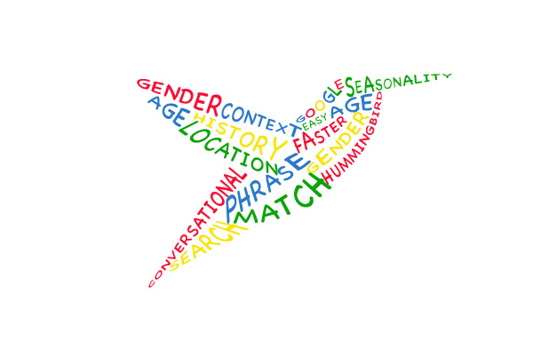

Context, Semantics, Conversational Search

---

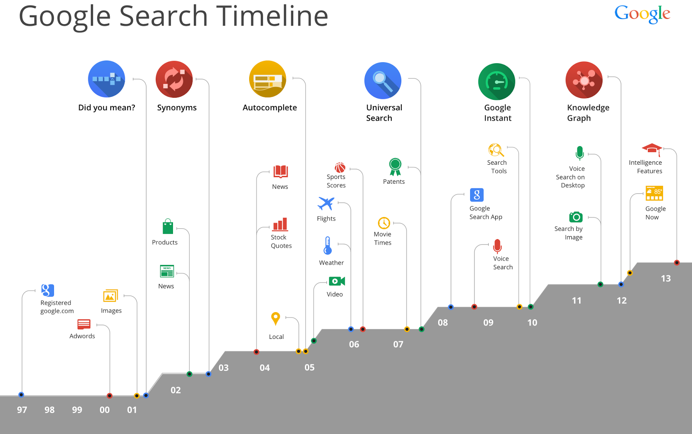

http://googleitalia.blogspot.com/2013_09_01_archive.html

---

# Rich Snippets

---

## Rich Snippets

Three syntaxes for embedding semantic data on Web:

* Microdata
* Microformats
* RDFa

---

## Rich Snippets: Microdata

```
<div itemscope itemtype="http://data-vocabulary.org/Person"> 
  My name is <span itemprop="name">Mike Nescot</span> 
  but people call me <span itemprop="nickname">Mike</span>. 
  I live in Washington, DC and work as <span itemprop="title">Web Operations Manager</span>
  for <span itemprop="affiliation">JBS International, Inc.</span>.
</div>
```

---

## Rich Snippets: Microformats (hcard)

```
<div class="vcard">
   <strong class="fn">Mike Nescot</strong>
   <span class="title">Web Operations Manager</span> at 
   <span class="org">JBS International, Inc.</span>
   <span class="adr">
      <span class="street-address">5515 Security Lane, Suite 800</span>
      <span class="locality">North Bethesda</span>, 
      <span class="region">MD</span>
      <span class="postal-code">20852</span>
   </span>
</div> 
```

---

## Rich Snippets: RDFa

```
<div xmlns:v="http://rdf.data-vocabulary.org/#" typeof="v:Person">
  My name is <span property="v:name">Mike Nescot</span>, 
  but people call me <span property="v:nickname">Mike</span>.
  I live in Washington, DC and work as 
  <span property="v:title">Web Operations Manager</span>
  for <span property="v:affiliation">JBS International, Inc.</span>.
</div>
```

---

## schema.org

* Microdata vocabulary

* Type hierarchy (top-level thing and data types)

* Mappings to Web data vocabularies, including: DBpedia, Dublin Core, FOAF, Good Relations, SIOC, BIBO, WordNet. See: http://schema.rdfs.org/mappings.html

---

## schema.org

* Collaboration by Google, Microsoft, and Yahoo! to create a common vocabulary for describing the data on the Web.

* 570 million objects and more than 18 billion facts.

* Used by over 1.5 million sites.

---

## Web sites using Microdata

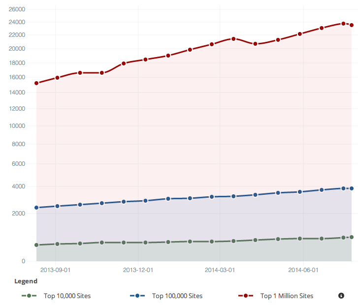

http://trends.builtwith.com/docinfo/Microdata

---

## schema.org & Google

* Google currently supports rich snippets for people, places, events, reviews, products, recipes, and breadcrumb navigation.

* New schema entities to be utilized include job listings and medical trials.

---

## schema.org & Google

> Google doesn't use markup for ranking purposes at this time - but rich snippets can make your Web pages appear more prominently in search results, so you may see an increase in traffic.

[Google Schema.org FAQ](https://support.google.com/webmasters/answer/1211158?hl=en)

---

## schema.org: Person

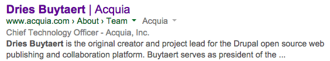

```
<div itemscope itemtype="http://schema.org/Person">
  <span itemprop="name">Dries Buytaert</span>
  <span itemprop="jobTitle">Chief Technology Officer</span>
  <span itemprop="schema:affiliation">Acquia, Inc.</span>
</div>
```

---

## schema.org: Event

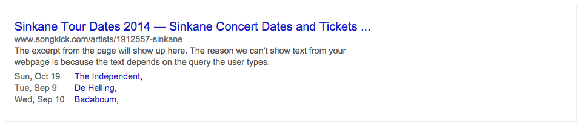

```
<div itemscope itemtype="http://schema.org/Event">
  <div itemprop="name">Sinkane</div>
  Event date:
  <time itemprop="startDate" datetime="2014-09-09T20:15:00+0200">May 8, 7:30pm</time>
  <p class="location" itemprop="location" itemscope="" itemtype="http://schema.org/Place">
  	<span itemprop="name" class="venue-name"><a href="/venues/560151-de-helling" itemprop="url">De Helling</a>,</span>
  	Utrecht, Netherlands
    <span itemprop="geo" itemscope="" itemtype="http://schema.org/GeoCoordinates">
    <meta itemprop="latitude" content="52.0768309">
    <meta itemprop="longitude" content="5.1217635">
    </span>
  </p>
</div>
```

---

## Knowledge Graph


---

> It's why we've been working on an intelligent model - in geek-speak, a "graph" - that understands real-world entities and their relationships to one another: things, not strings.

[Google Blog](http://googleblog.blogspot.com/2012/05/introducing-knowledge-graph-things-not.html)

---

## Knowledge Graph: People

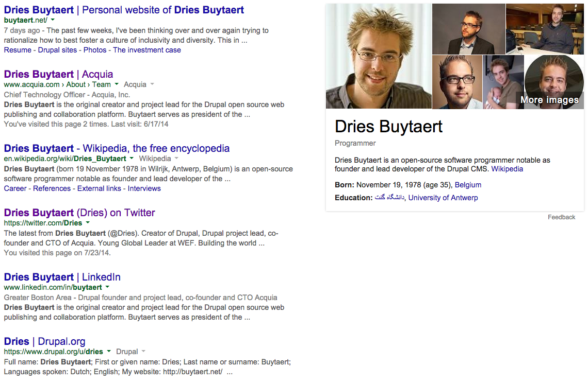

---

## Knowledge Graph: Places

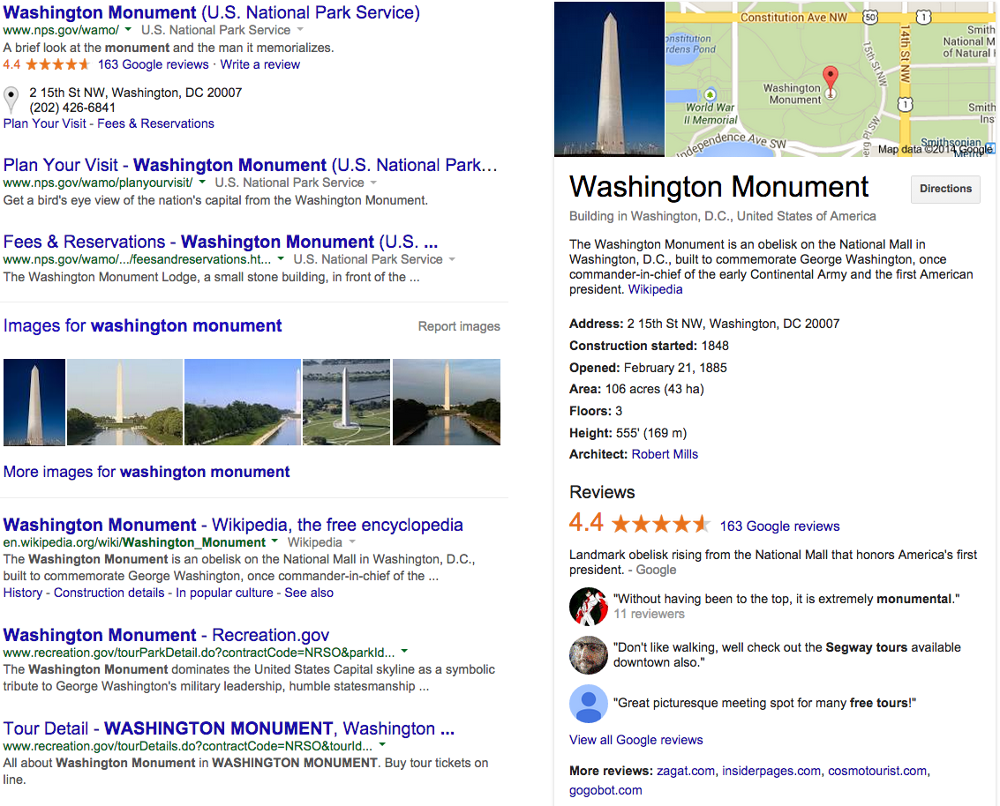

---

## Knowledge Graph: Recipes

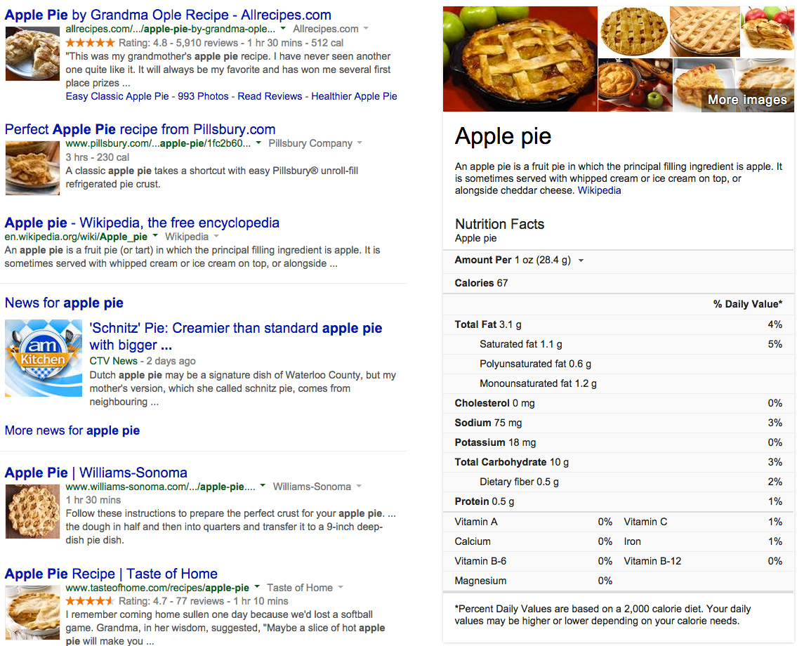

---

## Knowledge Graph: Products


---

## Knowledge Graph: Music


---

## Knowledge Graph: Businesses

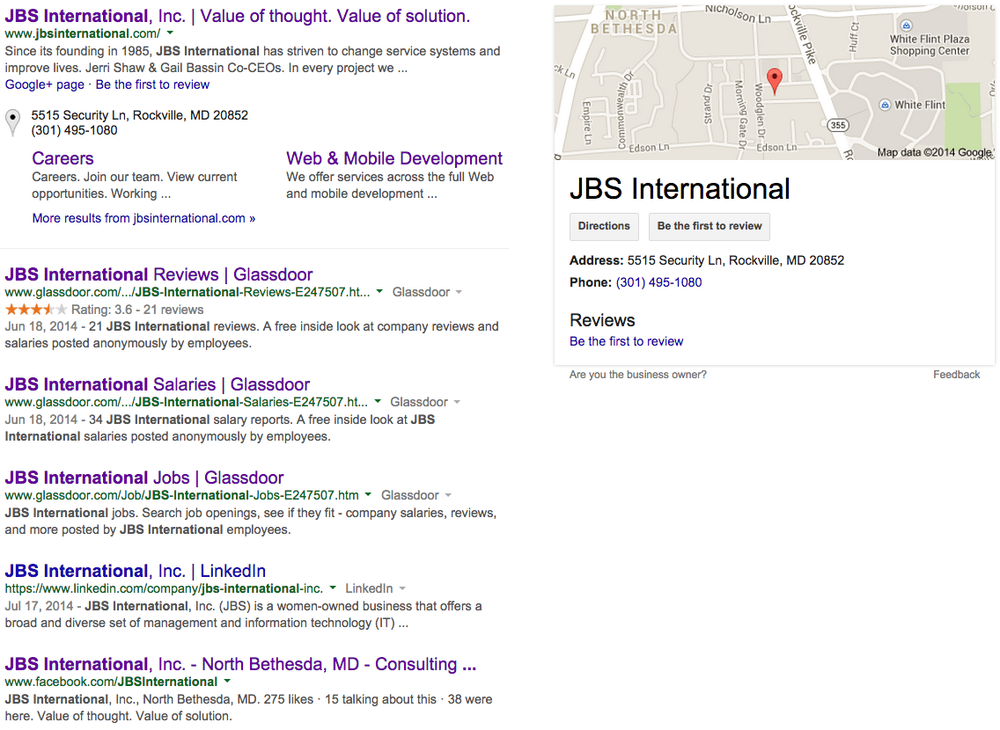

---

## Knowledge Graph: Events

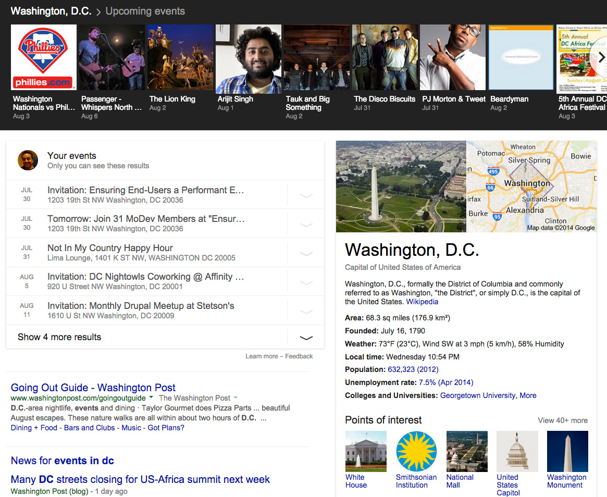

---

## Knowledge Graph: Timeline (beta)

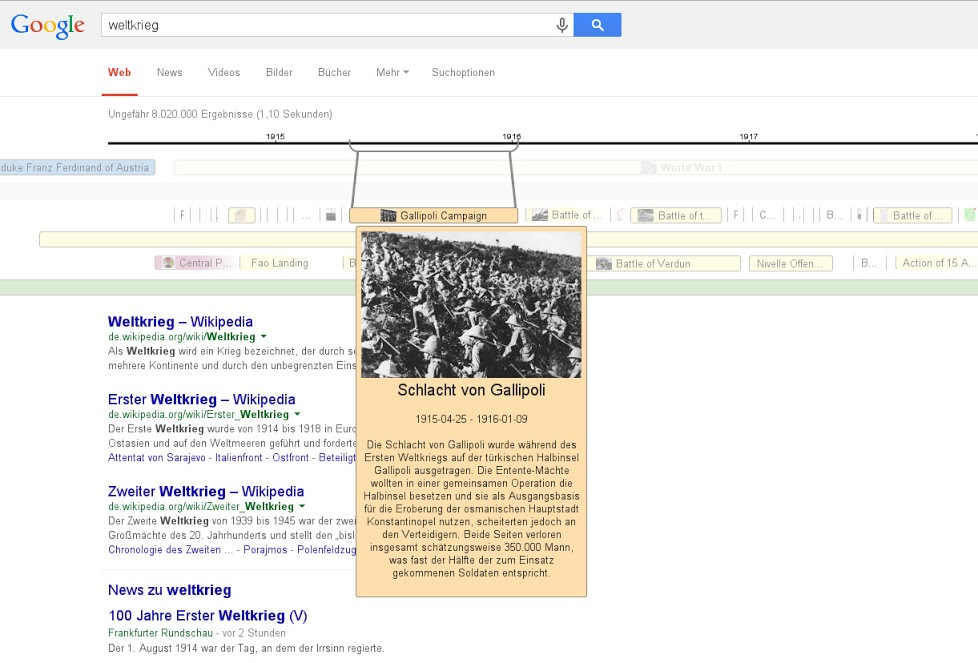

https://plus.google.com/+FlorianKiersch/posts/Eryy2punSVF

---

## Knowledge Graph: Timeline (beta)

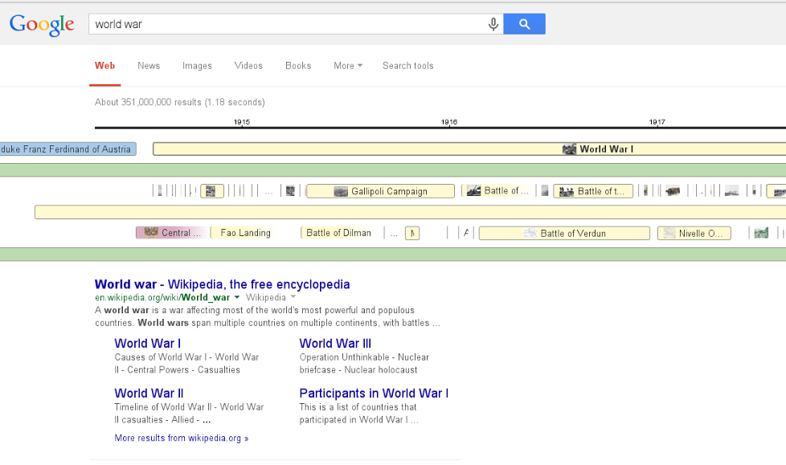

https://plus.google.com/+FlorianKiersch/posts/Eryy2punSVF

---

# schema.org Drupal Module

---

## schema.org Module

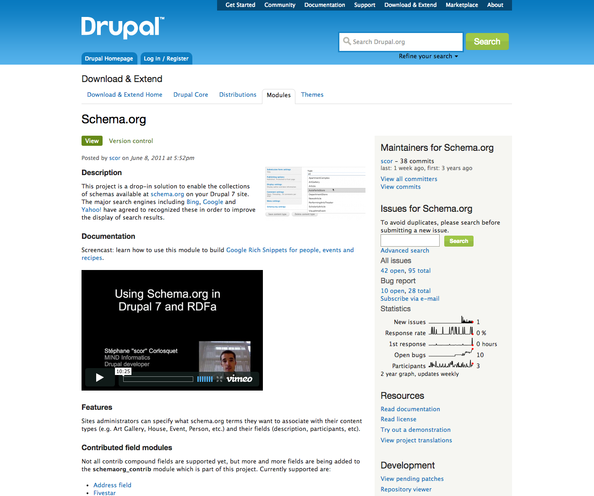

https://www.drupal.org/project/schemaorg

---

## State of schema.org in Drupal 8

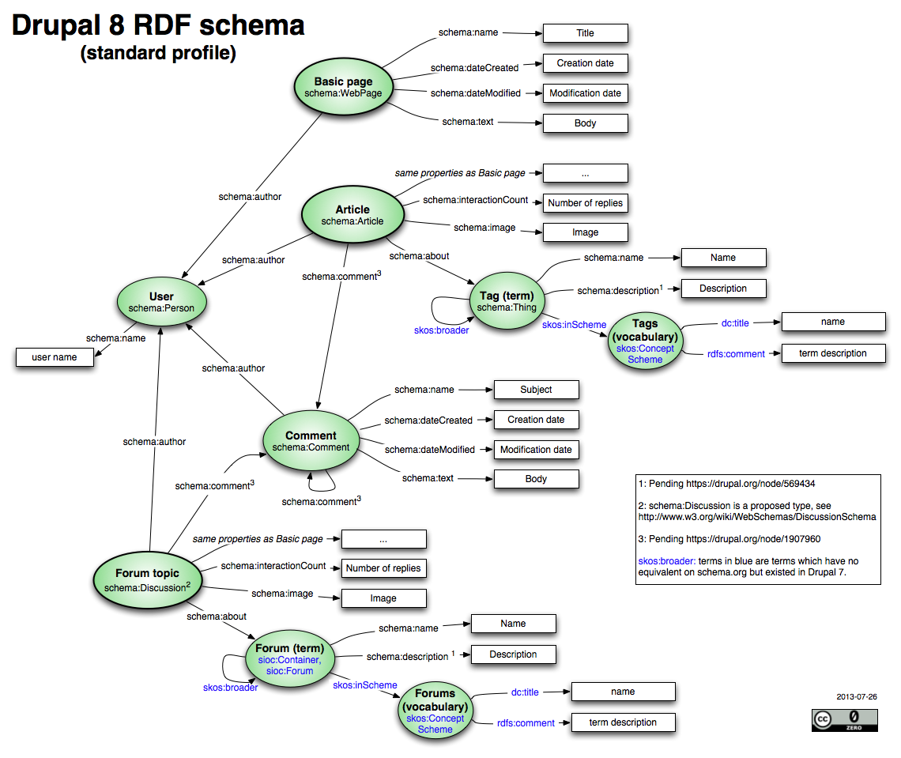

https://groups.drupal.org/node/309513

---

## The Rise of HTML 

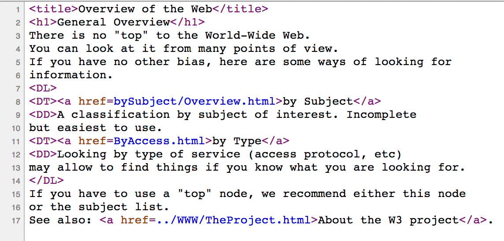

---

## The Fall of HTML 

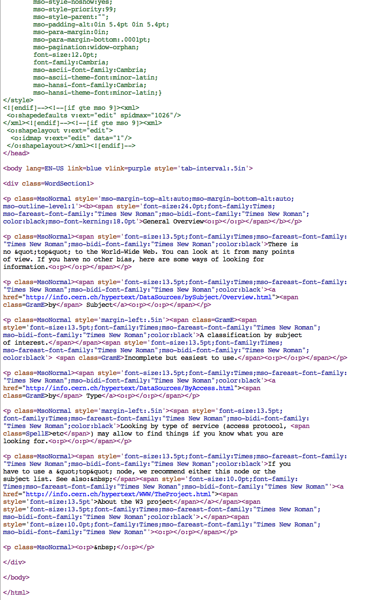

---

## Drupal 8: Simple, Clean HTML

```
<!DOCTYPE html>
<html{{ html_attributes }}>
  <head>
    {{ page.head }}
    <title>{{ head_title }}</title>
    {{ page.styles }}
    {{ page.scripts }}
  </head>
  <body{{ attributes }}>
    <a href="#main-content" class="visually-hidden focusable skip-link">
      {{ 'Skip to main content'|t }}
    </a>
    {{ page_top }}
    {{ page.content }}
    {{ page_bottom }}
    {{ page.scripts('footer') }}
  </body>
</html>
```
---

## Semanitc HTML ROI: Searchmetrics Report

+4 Positions

http://www.searchmetrics.com/media/documents/knowledge-base/searchmetrics_schemaorg-study_en_2014.pdf

---

### Schema.org: Medical Trial Schema Inheritance
https://schema.org/MedicalTrial

---

## Schema.org: Medical Study HTML
```
<div itemscope itemtype="http://schema.org/MedicalTrial">
<h1 itemprop="Name">Anti-Amyloid Treatment in Asymptomatic Alzheimer's Disease (A4)</h1>
<div itemprop="trialDesign" itemscope itemtype="http://schema.org/MedicalTrialDesign">
<span itemprop="Name">Allocation: Randomized</span>	
<div> itemprop="recognizingAuthority" itemscope itemtype="http://schema.org/Organization">
<span itemprop="Name">National Library of Medicine</span>
</div>
</div> 
<div itemprop="trialDesign" itemscope itemtype="http://schema.org/MedicalTrialDesign">
<span itemprop="Name">Endpoint Classification: Efficacy Study</span>
<span itemprop="recognizingAuthority" itemscope itemtype="http://schema.org/Organization">
<span itemprop="Name">National Library of Medicine</span>
</span>
</div> 
<div itemprop="trialDesign" itemscope itemtype="http://schema.org/MedicalTrialDesign">
<span itemprop="Name">Intervention Model: Parallel Assignment</span>
<div> itemprop="recognizingAuthority" itemscope itemtype="http://schema.org/Organization">
<span itemprop="Name">National Library of Medicine</span>
</div>
</div> 
<div itemprop="trialDesign" itemscope itemtype="http://schema.org/MedicalTrialDesign">
<span itemprop="Name">Masking: Double Blind (Subject, Caregiver, Investigator, Outcomes Assessor)</span>
<div itemprop="recognizingAuthority" itemscope itemtype="http://schema.org/Organization">
<span itemprop="Name">National Library of Medicine</span>
</div>
</div> 
<div itemprop="trialDesign" itemscope itemtype="http://schema.org/MedicalTrialDesign">
<span itemprop="Name">Primary Purpose: Treatment</span>
<div itemprop="recognizingAuthority" itemscope itemtype="http://schema.org/Organization">
<span itemprop="Name">National Library of Medicine</span>
</div>
</div> 
</div>
```
---

## HHS Content Syndication Store

https://syndication.hhs.gov/

---

## HHS Content Syndication API

https://api.hhs.gov/

---

## Content Syndication: Clinical Trial

```
<div class="syndicate">
<h1 class="title" id="page-title">Anti-Amyloid Treatment in Asymptomatic Alzheimer&#039;s Disease (A4)</h1>
</div>        
<div class="syndicate">
<div class="field field-name-overall-status field-type-text field-label-above"><div class="field-label">Overall Status:&nbsp;</div><div class="field-items"><div class="field-item even">Recruiting</div></div></div><div class="field field-name-adear-brief-description field-type-text field-label-above"><div class="field-label">Brief Description:&nbsp;</div><div class="field-items"><div class="field-item even"><p>This study will test whether an investigational drug, solanezumab, can slow the progression of memory problems associated with amyloid, a protein that forms plaques in the brains of people with Alzheimer disease. Participants who have normal thinking and memory function but may be at risk for developing Alzheimer&#39;s dementia are invited to participate. All volunteers will undergo a positron emission tomography (PET) scan to be determine their&nbsp;brain amyloid levels.</p></div></div></div><div class="field-collection-container clearfix"><div class="field field-name-qualifications field-type-field-collection field-label-above"><div class="field-label">Patient Qualifications:&nbsp;</div><div class="field-items"><div class="field-item even"><table class="field-collection-view-final sticky-enabled">
 <thead><tr><th class="minimum_age">Min Age</th><th class="maximum_age">Max Age</th><th class="gender">Gender</th><th class="healthy_volunteers">Healthy Volunteers</th> </tr></thead>
<tbody>
 <tr class="field_collection_item odd"><td class="minimum_age"><div class="field field-name-minimum-age field-type-text field-label-hidden"><div class="field-items"><div class="field-item even">65 Years</div></div></div></td><td class="maximum_age"><div class="field field-name-maximum-age field-type-text field-label-hidden"><div class="field-items"><div class="field-item even">85 Years</div></div></div></td><td class="gender"><div class="field field-name-gender field-type-text field-label-hidden"><div class="field-items"><div class="field-item even">Both</div></div></div></td><td class="healthy_volunteers"><div class="field field-name-healthy-volunteers field-type-text field-label-hidden"><div class="field-items"><div class="field-item even">Yes</div></div></div></td> </tr>
</tbody>
</table>
</div></div></div></div>
</div>
      
```
---
## Content Syndication In Action: NIA

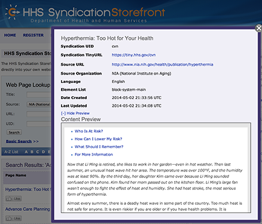

---

## Schema.org and JSON-LD

[JSON-LD, schema.org, and Google](https://developers.google.com/gmail/actions/reference/formats/json-ld)

---

## Schema.org: Medical Trial JSON-LD

```
{ 
 "@context": "http://schema.org",
 "@type": "MedicalTrial", 
 "name":"Anti-Amyloid Treatment in Asymptomatic Alzheimer's Disease (A4)",
  
  "trialDesign":{
  "@type": "MedicalTrialDesign",
  "name":"Allocation: Randomized",
  "recognizingAuthority":{
  "name":"National Library of Medicine"
    }
  	},
  	"trialDesign":{
  "@type": "MedicalTrialDesign",
  "name":"Endpoint Classification: Efficacy Study",
  "recognizingAuthority":{
  "name":"National Library of Medicine"
    }
  	},
  	"trialDesign":{
  "@type": "MedicalTrialDesign",
  "name":"Intervention Model: Parallel Assignment",
  "recognizingAuthority":{
  "name":"National Library of Medicine"
    }
  	},
  	"trialDesign":{
  "@type": "MedicalTrialDesign",
  "name":"Masking: Double Blind (Subject, Caregiver, Investigator, Outcomes Assessor)",
  "recognizingAuthority":{
  "name":"National Library of Medicine"
    }
  	},
  	"trialDesign":{
  "@type": "MedicalTrialDesign",
  "name":"Primary Purpose: Treatment",
  "recognizingAuthority":{
  "name":"National Library of Medicine"
    }
  	}

  	}

```

---

## Web Components

https://medium.com/cool-code-pal/introducing-web-components-and-what-it-means-for-search-engine-optimization-and-privacy-b21bfc1f63c7

* Custom Elements
* Shadow DOM
* HTML Imports


---

## Web Components: Medical Trial
```
<MedicalTrial name='Anti-Amyloid Treatment in Asymptomatic Alzheimer's Disease (A4)'
trialdesigns = '
"trialDesign":{
  "@type": "MedicalTrialDesign",
  "name":"Allocation: Randomized",
  "recognizingAuthority":{
  "name":"National Library of Medicine"
    }
    },
    "trialDesign":{
  "@type": "MedicalTrialDesign",
  "name":"Endpoint Classification: Efficacy Study",
  "recognizingAuthority":{
  "name":"National Library of Medicine"
    }
    },
    "trialDesign":{
  "@type": "MedicalTrialDesign",
  "name":"Intervention Model: Parallel Assignment",
  "recognizingAuthority":{
  "name":"National Library of Medicine"
    }
    },
    "trialDesign":{
  "@type": "MedicalTrialDesign",
  "name":"Masking: Double Blind (Subject, Caregiver, Investigator, Outcomes Assessor)",
  "recognizingAuthority":{
  "name":"National Library of Medicine"
    }
    },
    "trialDesign":{
  "@type": "MedicalTrialDesign",
  "name":"Primary Purpose: Treatment",
  "recognizingAuthority":{
  "name":"National Library of Medicine"
    }
    }
'
 >

</MedicalTrial>

```
---
## Facebook React: Alternative Components
* Virtual DOM
http://facebook.github.io/react/

---

## Resources

Slides: http://nickgrace.github.io/schema

[Google Structured Data Testing Tool](http://www.google.com/webmasters/tools/richsnippets)

[Structured Data Markup Helper](https://www.google.com/webmasters/markup-helper/u/0/)

[Schema.org Drupal Module](https://www.drupal.org/project/schemaorg)

[Schema.org Drupal Module Tutorial](https://www.drupal.org/node/1194024)


