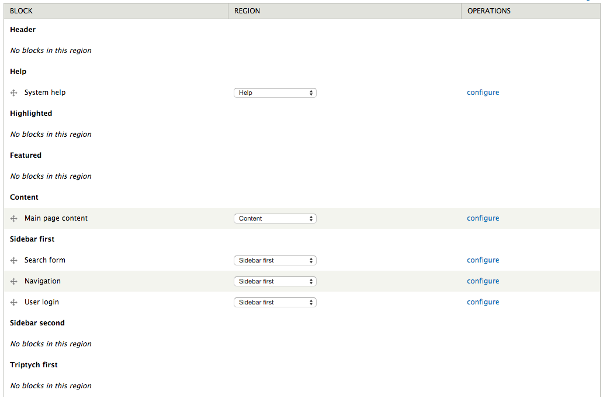
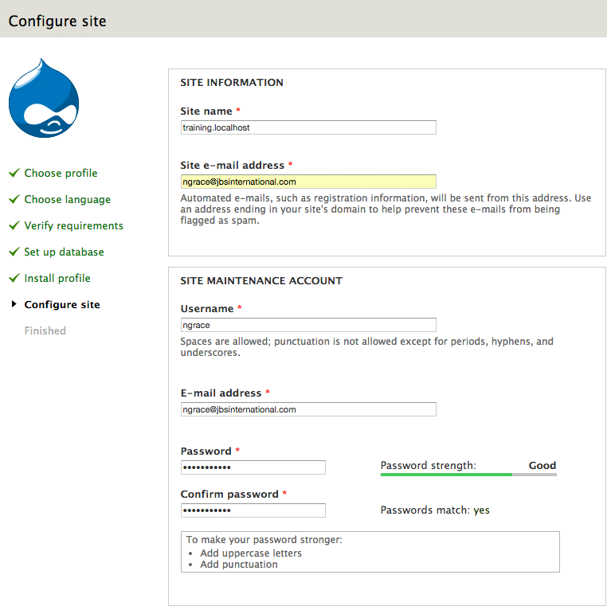

# Intro to Drupal

http://nickgrace.github.io/intro-to-drupal

--

## Hi! we're...

* Nick Grace, front end development manager at [JBS International, Inc.](http://www.jbsinternational.com) and front-end development instructor with [General Assembly](http://www.ga.co). I'm [@nickgrace](https://twitter.com/nickgrace) just about everywhere.

* Gordon Ng, director of ux & web development at [JBS International, Inc.](http://www.jbsinternational.com) I'm [@pangeum](https://twitter.com/pangeum) just about everywhere.

--

## JBS International, Inc.

--

## Agenda

* What is Drupal
* Download Drupal 7
* The 5 Minute Install
* Site Administration
* Content in Drupal
* Modules (Best Practices)
* Site Building (Best Practices)
* Theming (Best Practices)

---

# What is Drupal?

--

## What is Drupal?

* Content Management Framework
* Open Source - Under GPL General Public License
* Web Application Framework written in PHP
* A way for developers and non-developers to manage content.

--

## What is Drupal? 

* Created by Dries Buytaert in 2000.
* Derived from "Druppel," which means "Drop" and "Village" in Dutch.

--

## Platform Agnostic

* Apache / IIS / Unix / Linux / BSD / Solaris / Windows / Mac OS
* MySQL / PostgreSQL

--

## Benefits

* Standards-compliant
* Accessible
* Modular
* Stable
* Free

--

## Build

* Corporate Web sites
* Personal Web sites
* Community Web portals
* Intranet applications
* E-commerce applications

--

## Drupal Market Position

[Source: W3Techs](http://w3techs.com/technologies/details/cm-drupal/all/all)

--

## High Profile Sites

* [MSNBC](http://www.msnbc.com)
* [Tonight Show](http://www.nbc.com/the-tonight-show)
* [Virgin](http://www.virgin.com)
* [Conde Nast](http://www.condenast.com)
* [New York MTA](http://www.mta.info)

--

## State and Federal Sites

* [WhiteHouse.gov](http://www.whitehouse.gov)
* [Department of Energy](http://energy.gov)
* [U.S. Department of Transportation](http://www.transportation.gov)
* [Federal Communications Commission](http://www.fcc.gov)
* [California State Senate](http://senate.ca.gov)
* [District of Columbia Web Site](http://dc.gov)
* [Georgia State Government](http://www.georgia.gov)
* [Maryland Transit Administration](http://mta.maryland.gov)
* [New York State Senate](http://www.nysenate.gov)

--

## Drupal Community

* 1.1 million users
* 35,000 active developers
* 28,000 modules
* 2,000 themes
* 800 distributions

--

## Drupal Community

* irc.freenode.net
* Meetups
* Drupal Camps
* Drupalcon

--

## Drupal 8

--

## Drupal Ecosystem

[Source: Phase2 Technology](http://www.phase2technology.com/blog/a-code-free-explanation-of-drupal-distributions/)

--

## Drupal Ecosystem

1. Browser retrieves dynamic information from the database.
2. Browser checks retrieved data against relevant output filters.
3. Server inserts information into each core template.
4. Theme engine merges template files into template.php.
5. Browser displays formatted page in the Web browser.

--

## Drupal Ecosystem

* Drupal Core
* Nodes
* Fields
* Entities
* Blocks
* Menus
* Taxonomy
* Pages
* Regions
* Themes

--

## Drupal Core

* User role and permissions
* Core CMS capabilities
* Foundational modules
* System management

--

## Nodes

--

## Fields

--

## Entities

[An Introduction to Entities](https://www.drupal.org/node/1261744)
--

## Blocks

--

## Menus

--

## Taxonomy

--

## Pages

--

## Regions

[Source: How to view block regions in Drupal 7](http://www.inmotionhosting.com/support/edu/drupal-7/blocks-and-regions/find-regions)

--

## Drupal Flow

[Source: Drupal.org](https://www.drupal.org/getting-started/before/overview)

---

# Download Drupal 7

--

## Download Drupal 7

https://www.drupal.org/project/drupal

--

## Drupal 7 File Directory

--

## Drupal 7 File Directory

---

# The 5 Minute Install

--

## Acquia Dev Desktop

http://www.acquia.com/downloads

--

## Acquia Dev Desktop Dashboard

--

## Import New Site

--

## Import New Site

--

## Import New Site

--

## Import New Site

--

## Import New Site

--

## Visit Your New Site

---

# Site Administration

--

# Administration Menu

---

# Content in Drupal

---

# Modules (Best Practices)

---

# Site Building (Best Practices)

---

# Theming (Best Practices)

[Download Training Theme](gophers.zip)

---

# Resources

Slides: http://nickgrace.github.io/intro-to-drupal

* [Drupal.org](http://www.drupal.org)
* [Drupal Forums](https://www.drupal.org/forum)
* [Drupal IRC Channels](https://www.drupal.org/irc)
* [Daily Dose of Drupal](http://codekarate.com)
* [Drupalize.me](https://drupalize.me)
* [BuildAModule.com](https://buildamodule.com)
* [LevelUpTuts Drupal Tutorials](http://leveluptuts.com/tutorials/drupal-tutorials)

